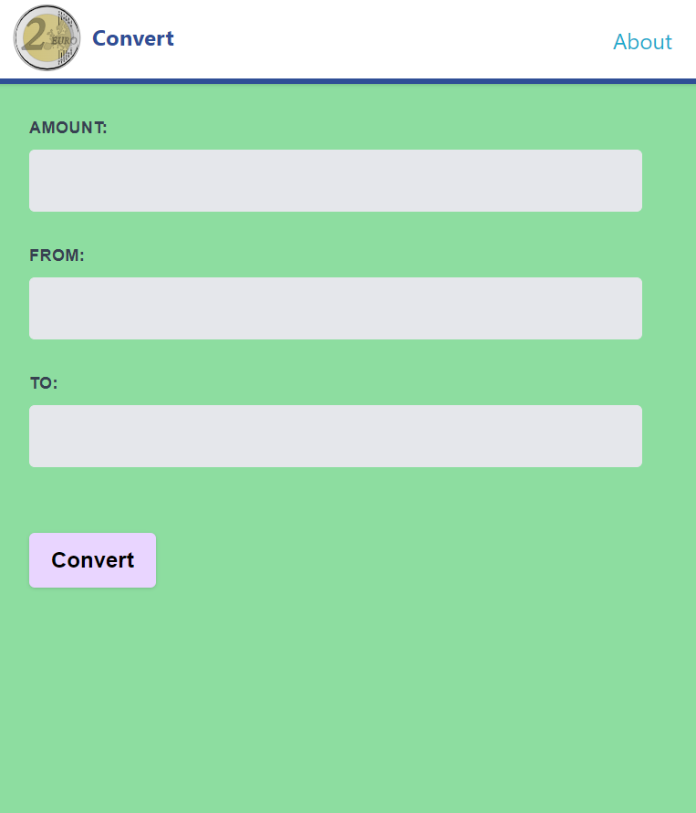
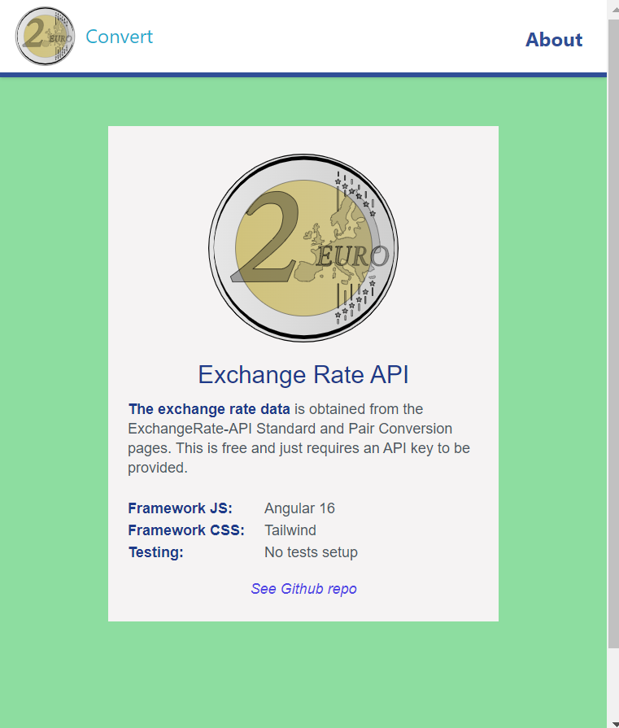

# :zap: Angular Tailwind Converter

* Angular app using RxJS, ng signals and Tailwind styles to display API currency conversion data.
* **Note:** to open web links in a new window use: _ctrl+click on link_


## :page_facing_up: Table of contents

* [:zap: Angular Tailwind Converter](#zap-angular-tailwind-converter)
  * [:page\_facing\_up: Table of contents](#page_facing_up-table-of-contents)
  * [:books: General info](#books-general-info)
  * [:camera: Screenshots](#camera-screenshots)
  * [:signal\_strength: Technologies](#signal_strength-technologies)
  * [:floppy\_disk: Setup](#floppy_disk-setup)
  * [:wrench: Testing](#wrench-testing)
  * [:computer: Code Examples](#computer-code-examples)
  * [:cool: Features](#cool-features)
  * [:clipboard: Status, Testing \& To-Do List](#clipboard-status-testing--to-do-list)
  * [:clap: Inspiration/General Tools](#clap-inspirationgeneral-tools)
  * [:file\_folder: License](#file_folder-license)
  * [:envelope: Contact](#envelope-contact)

## :books: General info

* Angular Signals used to track state of exchange rate data
* ExchangeRate-API data from [Standard Requests](https://www.exchangerate-api.com/docs/standard-requests) and [Pair Conversion Requests](https://www.exchangerate-api.com/docs/pair-conversion-requests) endpoints
* API date converted using [Angular DatePipe](https://angular.io/api/common/DatePipe)
* ISO 4217 Three Letter Currency Codes used - e.g. USD for US Dollars, EUR for Euro

## :camera: Screenshots




## :signal_strength: Technologies

* [Angular framework v16](https://angular.io/)
* [Tailwindcss v3](https://tailwindcss.com/) CSS framework
* [RxJS](https://www.learnrxjs.io/learn-rxjs/operators/transformation/map) map function used to extract just the API currency info needed
* [ExchangeRate-API v6](https://www.exchangerate-api.com/) for currency conversion data
* [quicktype](https://app.quicktype.io/) used to create typescript interface types

## :floppy_disk: Setup

* Install dependencies using `npm i`
* Obtain an API key from [https://www.exchangerate-api.com/](https://www.exchangerate-api.com/) and add to environment file or direct into code if no environment file
* Run `ng serve` for a non-SSR dev server. Frontend will open at `http://localhost:4200/` - refreshes on code changes
* Run `npm run build` to generate a build file without SSR

## :wrench: Testing

* Run `ng test` to run Jasmine unit tests via [Karma](https://karma-runner.github.io)

## :computer: Code Examples

* `rates.service.ts` function to extract a list of currencies from API data

```typescript
  // Fetch API data for list of currencies then use RxJS map
  // to extract only list of currencies then again to extract
  // Object keys then convert to a signal to be accessed by form page
  private currencyList$ = this.http
    .get<Currencies>(`${this.apiUrl}${this.apiKey}/latest/EUR`)
    .pipe(
      map((currencies) => currencies.conversion_rates),
      map((key) => Object.keys(key))
    );
  currencyListData = toSignal(this.currencyList$, { initialValue: [] });
```

## :cool: Features

* Using standalone components and ng signals reduces code
* Tailwind styles also reduces build bundle size

## :clipboard: Status, Testing & To-Do List

* Status: Working
* Testing: n/a
* To-Do: Nothing

## :clap: Inspiration/General Tools

* [Install Tailwind CSS with Angular](https://tailwindcss.com/docs/guides/angular)

## :file_folder: License

* This project is licensed under the terms of the MIT license.

## :envelope: Contact

* Repo created by [ABateman](https://github.com/AndrewJBateman), email: `gomezbateman@gmail.com`
